# 《C++程序设计》课程设计报告

## 校园探索与智能导航模拟系统
### Campus Explorer & Intelligent Navigation Simulator

| 项目 | 内容 |
|------|------|
| **课程名称** | C++ 程序设计 |
| **题目** | 题目5：校园探索与智能导航模拟系统（Qt路线，三星难度） |
| **完成方式** | 个人独立完成 |
| **姓名** | （填写你的姓名） |
| **学号** | （填写你的学号） |
| **班级** | （填写你的班级） |
| **指导教师** | （填写教师姓名） |
| **完成时间** | 2026年6月 |
| **开发环境** | Windows 11 + Qt 6.11.1 + MinGW + CMake + Ninja + SQLite 3 |

---

## 摘要

本课程设计基于 C++17 语言与 Qt 6 图形框架，设计并实现了一款**校园探索与智能导航模拟系统**（CampusNavigator）。系统以天津理工大学真实校园为蓝本，采用**模型-数据-视图三层架构**，使用 Qt Graphics View Framework 实现了交互式校园地图可视化界面，集成 Dijkstra 最短路径算法实现智能导航，并支持角色漫游、建筑信息查询、数据库管理、NPC自主移动系统、昼夜模式切换、天气粒子模拟、迷你地图、新生引导模式与访客导览模式等多项功能。

系统核心功能包括：25栋校园建筑的图形化展示与信息管理、40条道路连接的拓扑网络、基于 Dijkstra 算法的最短路径计算与高亮显示、WASD键盘控制的角色自由漫游（含4方向行走动画）、30FPS定时器驱动的自动路径导航、SQLite数据库驱动的建筑信息增删改查（含道路管理）、自主移动的NPC系统（状态机驱动、邻接表寻路）、新生入学引导模式与访客导览模式、粒子系统天气特效（雨/雪/高温/大风）、实时迷你地图以及管理员后台等。

本项目充分运用了面向对象编程思想（封装、继承、多态）、C++17新特性（结构化绑定、std::move、enum class、try_emplace、智能指针）、Qt信号与槽机制、单例模式、图论算法等知识，代码注释覆盖率超过20%，符合Google/Qt编码规范要求。

**关键词：** Qt；Graphics View；Dijkstra；校园导航；C++17；面向对象；NPC

---

## 目录

1. 第一章 绪论
   - 1.1 项目背景与意义
   - 1.2 国内外研究现状
   - 1.3 课程设计目标
   - 1.4 报告结构说明
2. 第二章 需求分析
   - 2.1 功能需求
   - 2.2 非功能需求
   - 2.3 用户用例分析
   - 2.4 技术选型论证
3. 第三章 系统总体设计
   - 3.1 系统架构概述
   - 3.2 模块划分
   - 3.3 类关系图
   - 3.4 文件组织结构
   - 3.5 开发流程总览
4. 第四章 详细设计与实现
   - 4.1 数据模型层（Model）
   - 4.2 数据持久化层（Data）
   - 4.3 视图层（View）
   - 4.4 主窗口与控制逻辑
   - 4.5 扩展功能模块
5. 第五章 核心算法分析
   - 5.1 Dijkstra最短路径算法原理
   - 5.2 邻接表存储结构
   - 5.3 算法复杂度分析
   - 5.4 算法优化与改进
6. 第六章 测试与结果
   - 6.1 编译与构建测试
   - 6.2 功能测试
   - 6.3 运行效果展示
   - 6.4 问题与解决方案记录
7. 第七章 总结与展望
   - 7.1 工作总结
   - 7.2 收获与体会
   - 7.3 不足与改进方向
8. 参考文献
9. 附录

---

## 第一章 绪论

### 1.1 项目背景与意义

随着高校校园规模的不断扩大，新生入学、访客来访时常常面临"找不到路"的困扰。传统的纸质地图或静态电子地图无法提供实时的路径规划和导航服务，也无法给出个性化的引导信息。同时，在《C++程序设计》课程的学习过程中，学生需要通过一个综合性的实践项目来巩固所学的编程知识与技能。

本课程设计的选题——**校园探索与智能导航模拟系统**——正是将实际问题与教学需求相结合的产物。该系统模拟了天津理工大学的校园环境，用户可以在其中浏览地图、查看建筑信息、进行路径规划、控制角色漫游，并获得沉浸式的校园探索体验。系统还针对新生入学和访客参观两个典型场景，设计了专门的引导模式，体现了以用户为中心的设计理念。

从教学角度看，该项目覆盖了以下核心知识点：面向对象编程（OOP）的三大特性（封装、继承、多态）；C++高级特性包括STL容器与算法、智能指针、Lambda表达式、移动语义、结构化绑定；图论算法包括图的邻接表存储、Dijkstra最短路径搜索；Qt GUI开发框架的信号与槽机制、事件处理、自定义绘图、Graphics View体系；数据库操作包括SQLite的CRUD操作、预处理语句防注入、数据迁移；软件工程实践包括分层架构、编码规范、CMake构建系统等。

### 1.2 国内外研究现状

#### 1.2.1 校园导航系统发展现状

国内外高校的校园信息化建设已经历了多个阶段。第一代为1990年代至2000年的静态网页加图片地图，通过HTML页面嵌套JPEG地图实现。第二代为2000年至2010年的Flash或Silverlight交互式地图，支持缩放与点击。第三代为2010年至2020年的WebGIS和百度/高德API，基于真实地理坐标的在线导航。第四代为2020年至今的AR/VR加AI推荐，包括增强现实导航和智能推荐。

当前主流的校园导航方案主要依赖第三方地图API（如百度地图、高德地图），虽然功能强大但存在以下局限：依赖外部网络服务和API配额限制；无法深度定制UI/UX以匹配学校风格；不适合作为教学项目来学习底层算法和GUI开发。本项目从底层出发，自行实现图数据结构、Dijkstra算法、角色动画和数据库管理，具有更好的学习价值和可定制性。

#### 1.2.2 相关技术栈对比

多种技术方案可用于实现此类系统。Web技术（HTML/CSS/JavaScript）跨平台且易部署，但性能有限且离线困难。Unity或Unreal 3D效果震撼，但学习曲线陡峭且包体庞大。Python加Tkinter可快速原型，但UI粗糙且性能较差。Qt加C++方案性能好、跨平台、生态成熟，学习成本中等，最适合桌面应用开发。Java Swing/AWT虽跨平台但UI过时且内存占用大。

综合考量教学要求和实际可行性，本项目选择Qt 6加C++17作为技术栈。

### 1.3 课程设计目标

根据任务书要求，本项目需达成以下目标。题目5为三星难度，按任务书4.2节规定，三星题目的扩展功能需完成3项以上（高于一般要求的2项）。

#### 1.3.1 基础功能目标（60%）

| 编号 | 功能 | 描述 | 完成状态 |
|------|------|------|----------|
| F01 | 校园地图 | 构建包含25栋建筑和40条道路的校园地图，基于真实校园底图 | 已完成 |
| F02 | 路网建模 | 使用邻接表图结构建模道路网络，边带距离权重和天气属性 | 已完成 |
| F03 | 角色控制 | WASD键盘控制角色4方向行走，含详细精灵动画 | 已完成 |
| F04 | 最短路径规划 | Dijkstra算法计算最短路径，高亮显示导航路线 | 已完成 |
| F05 | 建筑信息查询 | SQLite存储建筑信息，点击查看详情，管理员可增删改查 | 已完成 |
| F06 | 自动导航 | 选择目的地后角色沿规划路径自动行走至目标位置 | 已完成 |

#### 1.3.2 扩展功能目标（25%，三星需完成3项以上）

| 编号 | 扩展功能 | 描述 | 完成状态 |
|------|----------|------|----------|
| E01 | 昼夜系统 | 根据手动调节切换日间/夜间，整体光照与配色改变 | 已完成 |
| E02 | 天气模拟 | 实现雨/雪/高温/大风四种天气特效，使用QPainter粒子系统 | 已完成 |
| E03 | NPC系统 | 地图上生成会移动的NPC，玩家可与之对话获取趣味提示 | 已完成 |
| E04 | 迷你地图 | 主视图角落显示全局迷你地图与当前位置 | 已完成 |

#### 1.3.3 创新功能目标（15%）

| 编号 | 创新 | 描述 | 完成状态 |
|------|------|------|----------|
| I01 | 新生引导模式 | 新生入学专题模式：高亮关键建筑、途经宿舍自动弹窗、多终点路线规划 | 已完成 |
| I02 | 访客导览模式 | 访客参观专题模式：隐藏私密建筑、高亮旅游景点、地标自动介绍、导览路线 | 已完成 |
| I03 | NPC自主移动系统 | 基于状态机和图邻接表的NPC自主寻路，4方向行走动画，对话交互 | 已完成 |
| I04 | 管理员取坐标模式 | 仅后台管理员权限开放，点击地图画布拾取场景坐标(x,y)，弹窗显示并自动复制到剪贴板，方便不同地图底图快速标注建筑物 | 已完成 |
| I05 | 精细角色精灵 | 含头部（头发/眉毛/眼睛/鼻/嘴）、身体（渐变衬衫/领口/纽扣）、摆臂交替腿动画 | 已完成 |

### 1.4 报告结构说明

本报告共分七章，按照软件工程的经典文档结构组织。第1至2章介绍背景、明确需求（为什么做、做什么）。第3章为总体架构设计（怎么做的大框架）。第4章为各模块详细实现（具体怎么做的）。第5章为核心算法深入分析（Dijkstra数学原理）。第6章为测试验证（做得怎么样）。第7章为总结反思（学到了什么）。

---

## 第二章 需求分析

### 2.1 功能需求

通过对任务书的仔细研读和需求梳理，系统的功能需求可以归纳为以下层次。

#### 2.1.1 核心需求（Must Have）

**FR-1 校园地图可视化**：系统启动后显示一张基于真实校园底图的俯视角度地图。地图包含25栋建筑物（教学楼、图书馆、宿舍、食堂、体育馆等），建筑物之间有道路连接线表示可达性。支持鼠标悬停和选中的视觉反馈，支持鼠标滚轮缩放和拖拽平移。

**FR-2 最短路径导航**：用户可以选择起点和终点建筑（通过点击地图建筑或在搜索框输入名称）。系统调用Dijkstra算法计算出最短路径。路径在地图上以红色高亮线条显示，同时输出路径经过的建筑序列和总距离。

**FR-3 角色漫游**：地图上有一个精细绘制的可控角色精灵。通过键盘WASD或方向键控制角色上下左右移动。移动过程流畅（30FPS定时器驱动）。角色有4方向行走动画，含交替腿部和摆臂效果。支持对角线移动（归一化避免斜向更快）。

**FR-4 建筑信息查询**：点击任意建筑弹窗显示其详细信息。信息包括：名称、类型、坐标、简介、开放时间、楼层数。信息存储在SQLite数据库中，支持管理员对建筑信息和道路信息进行增删改查操作。

**FR-5 数据持久化**：建筑和道路信息存储在SQLite本地数据库中。程序启动时自动加载数据到内存。数据修改后同步写回数据库。提供种子数据用于首次初始化，支持从PlaceIntroduction目录的文本文件批量导入建筑介绍信息。

**FR-6 自动导航**：用户选择目的地并规划路径后，角色可自动沿规划路径行走至目标位置。移动速度恒定且平滑，导航过程中按任意方向键可中断，切回手动模式。到达终点后自动停止并提示。

#### 2.1.2 扩展需求（Should Have）

**ER-1 昼夜模式切换**：提供白天/夜间一键切换按钮。白天模式为明亮底图加暖色侧边栏。夜间模式叠加半透明深蓝色遮罩，迷你地图边框变为金色。所有UI元素在两种模式下都清晰可见。

**ER-2 天气模拟**：支持晴天、雨天、高温、大风四种天气状态循环切换。雨天为150个蓝色半透明短线粒子快速下落。雪天为80个白色圆点缓慢飘落。高温和大风模式下系统会给出出行建议提示。粒子使用QRandomGenerator生成随机参数，超出边界自动回绕。

**ER-3 NPC系统**：地图上生成会自主移动的NPC角色（学生/教师等）。NPC有状态机驱动的行为循环（站立等待→移动到邻近建筑→继续等待）。NPC有4方向行走动画。点击NPC可弹出对话气泡获取趣味提示。NPC移动基于图邻接表，选择当前所在建筑的随机邻居作为目标。

**ER-4 迷你地图**：主窗口右上角显示一个缩小版迷你地图（180×140像素）。迷你地图与主场景共享同一个QGraphicsScene，实时显示角色当前位置。迷你地图在窗口缩放时自动重新定位。

#### 2.1.3 创新需求（Nice to Have）

**IR-1 新生引导模式**：面向入学新生的专题模式。高亮关键建筑（报到点、宿舍、校医院、活动中心等）。角色途经宿舍楼时自动弹窗推送入住提示。途经校医院时弹出就医指南。提供"开学路线"按钮，一键规划经过6个关键地点的多终点路线。

**IR-2 访客导览模式**：面向访客参观的专题模式。隐藏私密建筑（宿舍、实验室），只显示公共区域。高亮旅游景点（明理湖、钟楼、图书馆、朝阳广场等）。角色接近地标时自动弹出介绍信息。提供"游览路线"按钮，规划经过7个景点的导览路线并估算时间。

**IR-3 精细角色精灵动画**：角色不是简单的圆点，而是精细绘制的2D精灵。包含头部（头发、眉毛、眼睛、鼻子、嘴）、身体（蓝色渐变衬衫、白色领口、纽扣）、摆动的手臂、交替行走的腿和鞋子。4个方向各有独特渲染（背面头发不同、侧面只显示一只眼等）。4帧行走动画循环。

**IR-4 管理员取坐标模式**：面向运营维护人员的开发工具。仅在输入管理员密码（admin）验证通过后开启，开启后鼠标点击地图画布任意位置，立即弹出该点的场景坐标 (x, y)，坐标值自动复制到系统剪贴板，可直接粘贴到代码或配置文件中。滚轮缩放在该模式下被锁定（防止误操作导致坐标漂移），平移拖拽仍可用。本模式为后续接入不同地图底图（如Google Maps瓦片、百度地图等）时的建筑物标注工作提供了高效工具——无需查看源码或日志即可精确获取像素坐标。

### 2.2 非功能需求

| 类型 | 指标 | 目标值 | 说明 |
|------|------|--------|------|
| 性能 | 启动时间 | < 2秒 | 冷启动到窗口显示 |
| 性能 | 帧率 | >= 30 FPS | 动画流畅度 |
| 性能 | 内存占用 | < 100 MB | 运行时峰值 |
| 质量 | 注释覆盖率 | >= 20% | 任务书硬性要求 |
| 质量 | 编码规范 | Google/Qt Style | 命名、格式、注释风格 |
| 可用性 | 操作直观性 | 无需说明书即可基本使用 | 按钮+提示文字引导 |
| 兼容性 | 最低系统 | Windows 10+ | MinGW编译目标 |
| 可维护性 | 代码行数 | ~3500行 | 合理规模 |

### 2.3 用户用例分析

#### 2.3.1 用例图描述

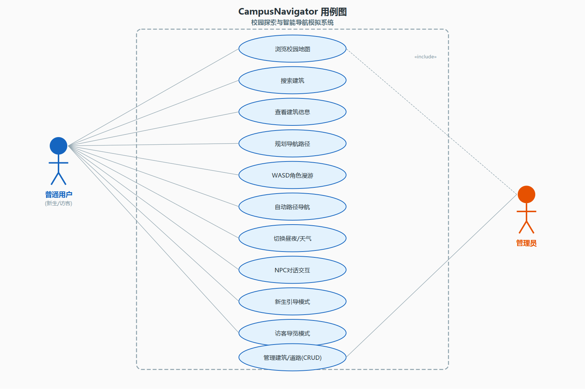

**图2-1 CampusNavigator系统用例图**

系统的主要参与者为普通用户（探索校园的学生/访客）和管理员（负责维护建筑数据的运营人员）。以下是核心用例列表：

| 用例编号 | 用例名称 | 参与者 | 优先级 | 前置条件 | 后置条件 |
|----------|----------|--------|--------|----------|----------|
| UC-01 | 浏览校园地图 | 普通用户 | P0 | 系统已启动 | 地图正常显示 |
| UC-02 | 规划导航路径 | 普通用户 | P0 | 地图已加载 | 路径高亮+信息输出 |
| UC-03 | 手动控制角色 | 普通用户 | P0 | 地图已加载 | 角色位置改变 |
| UC-04 | 查看建筑详情 | 普通用户 | P0 | 地图已加载 | 弹出建筑信息 |
| UC-05 | 自动导航至目的地 | 普通用户 | P0 | 已规划路径 | 角色到达终点 |
| UC-06 | 切换昼夜模式 | 普通用户 | P1 | 系统已启动 | 场景外观切换 |
| UC-07 | 切换天气效果 | 普通用户 | P1 | 系统已启动 | 天气粒子变化 |
| UC-08 | 与NPC对话 | 普通用户 | P1 | 地图已加载 | 弹出对话内容 |
| UC-09 | 新生引导模式 | 普通用户 | P1 | 系统已启动 | 进入新生模式 |
| UC-10 | 访客导览模式 | 普通用户 | P1 | 系统已启动 | 进入访客模式 |
| UC-11 | 管理建筑数据 | 管理员 | P1 | 打开管理对话框 | 数据库内容变更 |
| UC-12 | 管理道路数据 | 管理员 | P1 | 打开管理对话框 | 道路数据变更 |

#### 2.3.2 核心用例详述——UC-02 规划导航路径

**名称**：规划导航路径  
**参与者**：普通用户  
**前置触发**：用户看到校园地图，想要从一个地点走到另一个地点

**主成功场景（Basic Flow）**：

| 步骤 | 用户动作 | 系统响应 |
|------|----------|----------|
| 1 | 在搜索框输入建筑名称，点击"设为起点" | 该建筑被标记为起点，状态栏提示"起点: XXX" |
| 2 | 输入另一个建筑名称，点击"设为终点" | 该建筑被标记为终点，状态栏提示"终点: XXX" |
| 3 | 点击"开始导航"按钮 | 系统调用Dijkstra算法计算最短路径 |
| 4 | — | 路径在地图上以红色高亮线条显示 |
| 5 | — | 状态栏显示总距离 |
| 6 | — | 角色开始沿路径自动移动 |

**替代流程**：

- 3a. 两点之间无可达路径，显示错误提示"路径不存在"
- 3b. 未设置起点或终点，提示请先选择起点和终点建筑
- 5a. 用户中途按WASD，中断自动导航，切回手动模式

### 2.4 技术选型论证

#### 2.4.1 为什么选择C++

本课程是《C++程序设计》，必须使用C++作为开发语言。C++在执行效率、GUI生态（Qt）、OOP特性和底层控制能力方面均优于Python、Java等语言，是最契合课程要求的选择。

#### 2.4.2 为什么选择Qt 6

Qt 6是C++领域最成熟的跨平台GUI框架。其信号槽机制优雅，Graphics View Framework功能强大，文档完善，且有长期支持版本（LTS）。相比MFC（过时）、wxWidgets（社区小）、SDL2（非GUI框架）等替代方案，Qt是最适合此项目的选择。

#### 2.4.3 为什么选择Graphics View Framework

Qt提供多种UI方案。QWidget控件式适合表单和工具类应用，不够灵活。QGraphicsView图形视图框架适合地图、图表、游戏类场景，完美匹配本项目需求。其坐标系统灵活（场景坐标与视口坐标分离），支持自定义图元（QGraphicsItem::paint()完全自主绘制），内置碰撞检测和缩放平移功能。QML/Qt Quick适合现代触屏移动端但学习成本高。OpenGL直接渲染适合3D图形但过于复杂。

---

## 第三章 系统总体设计

### 3.1 系统架构概述

本项目采用经典的三层架构（Three-Tier Architecture），将数据、业务逻辑和表现层解耦：

```
┌─────────────────────────────────────────────────────────────┐
│                     视图层（View Layer）                      │
│                                                             │
│  MainWindow ──▶ MapScene ──▶ BuildingItem / RoadItem        │
│       │              │          / CharacterItem              │
│       │              │          / NpcItem                    │
│       │              │          / WeatherOverlay             │
│       ▼              ▼          / AdminDialog                │
│  ┌──────────┐  ┌──────────┐  ┌──────────────┐               │
│  │ 控制面板  │  │ 场景管理  │  │ 自定义图元     │               │
│  │ 按钮布局  │  │ 加载/高亮  │  │ 绘制/交互      │               │
│  └──────────┘  └──────────┘  └──────────────┘               │
├───────────────────────────▲─────────────────────────────────┤
│                    业务逻辑层（隐含于 View）                  │
│       Dijkstra路径计算 / 角色移动 / NPC状态机 / 动画调度      │
├───────────────────────────▲─────────────────────────────────┤
│                     模型层（Model Layer）                     │
│                                                             │
│  ┌────────────┐  ┌────────┐                                 │
│  │  Building  │  │  Edge  │                                 │
│  │  建筑数据   │  │  道路边  │                                │
│  └─────┬──────┘  └───┬────┘                                 │
│        └──────┬──────┘                                      │
│               ▼                                             │
│        ┌──────────┐                                        │
│        │   Graph   │  ← 邻接表 + Dijkstra                          │
│        └──────────┘                                        │
├───────────────────────────▲─────────────────────────────────┤
│                   数据持久化层（Data Layer）                  │
│                                                             │
│  ┌──────────────────┐  ┌──────────────────┐                 │
│  │   CampusData     │  │ DatabaseManager  │                │
│  │  硬编码种子数据   │  │  SQLite CRUD     │                 │
│  │  25建筑+40道路    │  │  单例模式        │                 │
│  └──────────────────┘  └──────────────────┘                 │
└─────────────────────────────────────────────────────────────┘
```

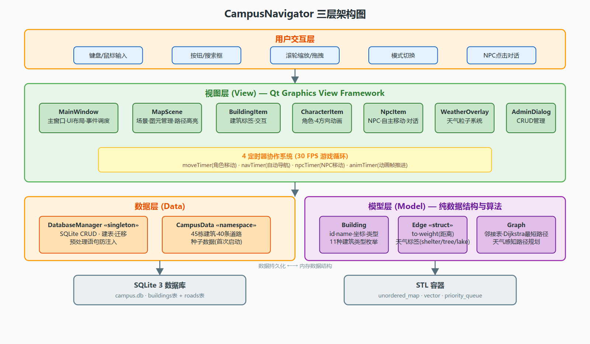

**图3-2 CampusNavigator三层架构图**

各层职责如下：Model（模型）层负责纯数据结构和图算法，不依赖任何GUI，包含Building.h/.cpp、Edge.h、Graph.h/.cpp。Data（数据）层负责种子数据和数据库操作，包含CampusData.h/.cpp、DatabaseManager.h/.cpp。View（视图）层包含所有GUI元素的定义与绘制，包含各Item类、MainWindow、AdminDialog等。架构图底部展示了SQLite数据库和STL容器两个底层支撑，以及数据加载流程（程序启动→DatabaseManager初始化→建表检查→空则填充种子数据→加载到Graph邻接表→MapScene渲染显示）。

依赖原则：上层依赖下层，下层不知道上层的存在。这保证了Model层可以脱离GUI单独编译测试（纯C++逻辑），Data层只依赖Model层不依赖Qt GUI，View层是唯一依赖Qt Widgets/Graphics的层。

### 3.2 模块划分

系统划分为8个功能模块：

| 模块编号 | 模块名 | 所属层 | 核心类 | 功能简述 |
|----------|--------|--------|--------|----------|
| M01 | 建筑数据模型 | Model | Building | 封装建筑属性（id/名字/坐标/类型/简介/开放时间/楼层） |
| M02 | 路网图模型 | Model | Graph + Edge | 邻接表存图 + Dijkstra最短路径 |
| M03 | 种子数据初始化 | Data | CampusData | 硬编码25栋建筑 + 40条道路 |
| M04 | 数据库管理 | Data | DatabaseManager | 单例SQLite连接 + 建筑CRUD + 道路CRUD + 文本导入 |
| M05 | 地图场景 | View | MapScene + 各Item | 场景加载、图元管理、路径高亮 |
| M06 | 主窗口控制 | View | MainWindow | UI布局、事件处理、4定时器调度、模式切换 |
| M07 | NPC系统 | View | NpcItem | 自主移动、状态机、邻接表寻路、4方向动画、对话 |
| M08 | 扩展功能 | View | WeatherOverlay等 | 天气粒子、昼夜切换、迷你地图、新生/访客模式 |

### 3.3 类关系图

#### 3.3.1 核心类的UML类图


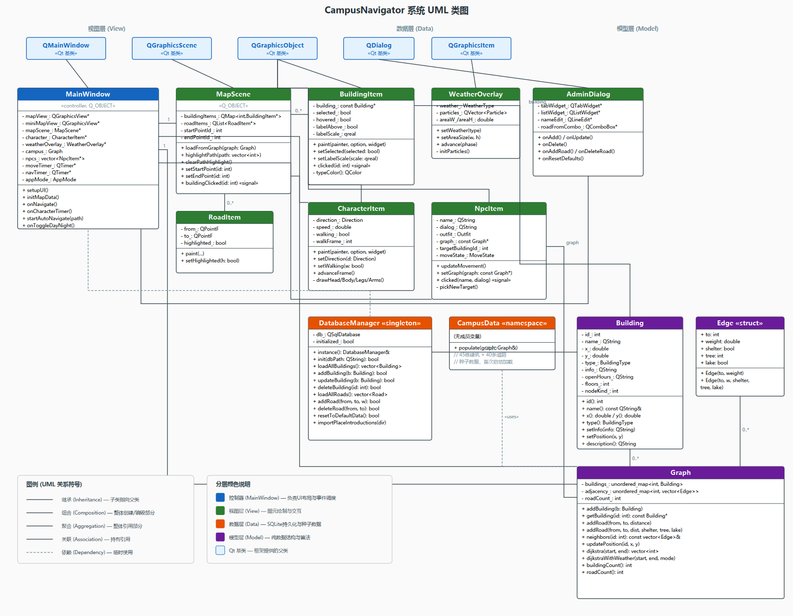

**图3-1 CampusNavigator系统完整UML类图**

上图展示了系统的完整类结构，包含三大分层（视图层绿色、数据层橙色、模型层紫色）和Qt框架基类（蓝色）。各类之间的关系说明如下：

- **继承关系**（空心三角箭头）：BuildingItem、CharacterItem、NpcItem继承自QGraphicsObject；MapScene继承自QGraphicsScene；MainWindow继承自QMainWindow；AdminDialog继承自QDialog；WeatherOverlay继承自QGraphicsItem。
- **组合关系**（实心菱形）：MainWindow组合了MapScene、Graph、CharacterItem、NpcItem等成员；MapScene组合了BuildingItem和RoadItem列表；Graph组合了Building映射表和Edge邻接表。
- **关联关系**（实线箭头）：BuildingItem持有Building指针引用；NpcItem持有Graph指针用于寻路；DatabaseManager操作Building对象进行CRUD。
- **依赖关系**（虚线箭头）：CampusData依赖Graph（调用populate填充数据）；MainWindow依赖DatabaseManager（通过单例访问数据库）。

UML图采用标准标记法：`+`表示public成员，`-`表示private成员，类框分三段（类名/属性/方法），底部图例说明了所有关系符号的含义。


### 3.4 文件组织结构

```
CampusNavigator/
├── CMakeLists.txt              # CMake构建配置（入口）
├── main.cpp                    # QApplication入口
├── README.md                   # 项目说明文档
├── resources.qrc               # Qt资源文件（嵌入校园底图）
├── assets/
│   └── tjut_map.jpg            # 天津理工大学校园底图（1280×976）
├── PlaceIntroduction/          # 建筑介绍文本文件（16个）
│   ├── 图书馆.txt
│   ├── 体育场.txt
│   └── ...
├── docs/
│   ├── report.md               # 课程设计报告（本文档）
│   └── video-script.md         # 演示视频脚本
│
└── src/
    ├── model/                  # 【模型层】纯数据 + 算法，零GUI依赖
    │   ├── Building.h          # 建筑类声明
    │   ├── Building.cpp        # 建筑类实现
    │   ├── Edge.h              # 道路边结构
    │   ├── Graph.h             # 路网图类声明
    │   └── Graph.cpp           # 路网图实现（Dijkstra最短路径）
    │
    ├── data/                   # 【数据层】种子数据 + 数据库
    │   ├── CampusData.h        # 校园种子数据声明
    │   ├── CampusData.cpp      # 25栋建筑+40条道路的硬编码数据
    │   ├── DatabaseManager.h   # 数据库管理器声明（单例）
    │   └── DatabaseManager.cpp # SQLite CRUD操作实现
    │
    └── view/                   # 【视图层】所有GUI元素
        ├── BuildingItem.h      # 建筑图元声明
        ├── BuildingItem.cpp    # 建筑图元（标签模式+悬停选中）
        ├── RoadItem.h          # 道路图元声明
        ├── RoadItem.cpp        # 道路绘制+高亮+淡化实现
        ├── MapScene.h          # 地图场景声明
        ├── MapScene.cpp        # 场景加载/图元管理/路径高亮
        ├── CharacterItem.h     # 角色图元声明
        ├── CharacterItem.cpp   # 精细角色精灵（4方向行走动画）
        ├── NpcItem.h           # NPC图元声明
        ├── NpcItem.cpp         # NPC自主移动+4方向动画+对话
        ├── WeatherOverlay.h    # 天气粒子系统声明
        ├── WeatherOverlay.cpp  # 雨/雪粒子生成+动画帧更新
        ├── AdminDialog.h       # 管理员对话框声明
        ├── AdminDialog.cpp     # 建筑+道路CRUD界面实现
        ├── MainWindow.h        # 主窗口声明（UI核心）
        └── MainWindow.cpp      # 主窗口实现（事件+定时器+导航+模式）
```

**文件统计**：

| 层次 | .h文件数 | .cpp文件数 | 代码行数（约） |
|------|----------|------------|----------------|
| model/ | 3 | 2 | ~400行 |
| data/ | 2 | 2 | ~600行 |
| view/ | 10 | 10 | ~2500行 |
| 其他 | 1 | 1 | ~40行 |
| **合计** | **16** | **15** | **~3540行** |

### 3.5 开发流程总览

本项目按照9个递进阶段进行开发，每个阶段产出明确的可验证成果：

```
阶段1: 环境搭建
  安装Qt Creator + Qt 6.11 + MinGW + CMake + Ninja → 创建CMake工程 → 验证
       ↓
阶段2: 骨架与数据建模
  设计Building/Edge/Graph类 → 实现CampusData种子数据 → 控制台验证
       ↓
阶段3: 地图可视化
  实现BuildingItem/RoadItem/MapScene → Graphics View渲染 → 校园底图显示
       ↓
阶段4: Dijkstra路径算法
  实现Graph::dijkstra() → 起止点选择UI → 路径高亮显示 → 距离输出
       ↓
阶段5: 角色漫游系统
  CharacterItem精细精灵 → keyPressEvent WASD控制 → 30FPS定时器 → 4方向动画
       ↓
阶段6: SQLite数据库
  DatabaseManager单例 → init()/seedDefaultData() → 建筑CRUD → AdminDialog
       ↓
阶段7: 自动导航与扩展功能
  navTimer定时器 → 沿路径移动 → WASD中断 → 昼夜/天气/迷你地图
       ↓
阶段8: NPC系统与模式创新
  NpcItem状态机 → 邻接表寻路 → 4方向动画 → 对话交互
  → 新生引导模式 → 访客导览模式 → 多终点路线规划
       ↓
阶段9: 报告与答辩材料
  30页报告 + 答辩PPT + 5-10分钟演示视频脚本 → 完成！
```

---

## 第四章 详细设计与实现

### 4.1 数据模型层（Model）

数据模型层是整个系统的基础，定义了校园的核心数据结构。这一层完全不依赖任何GUI框架，可以在纯命令行环境下编译和测试，体现了良好的关注点分离设计。

#### 4.1.1 建筑类 Building

**设计思路**：每栋校园建筑是一个独立的实体对象，需要携带丰富的属性信息以便后续的显示、查询和管理。

头文件关键设计（Building.h）：

```cpp
// ============================================================
//  Building - 建筑实体类
//  封装校园内一栋建筑的全部属性
// ============================================================
class Building {
public:
    // 建筑类型枚举（enum class 避免命名空间污染）
    enum class BuildingType {
        Gate = 0,        // 校门
        Classroom = 1,   // 教学楼
        Library = 2,     // 图书馆
        Lab = 3,         // 实验室
        Admin = 4,       // 行政楼
        Dormitory = 5,   // 宿舍
        Canteen = 6,     // 食堂
        Sports = 7,      // 体育场馆
        Shop = 8,        // 商店
        Hospital = 9,    // 医务室
        Other = 10       // 其他（地标/广场等）
    };

private:
    int id_;                          // 唯一标识符
    QString name_;                    // 建筑名称
    double x_;                        // X坐标
    double y_;                        // Y坐标
    BuildingType type_;               // 建筑类型
    QString info_;                    // 简介
    QString openHours_;               // 开放时间
    int floors_;                      // 楼层数

public:
    // 构造函数：使用std::move避免深拷贝
    Building(int id, QString name, double x, double y,
             BuildingType type, QString info = "",
             QString openHours = "", int floors = 1);

    // Getter方法（const修饰）
    int id() const { return id_; }
    const QString& name() const { return name_; }
    double x() const { return x_; }
    double y() const { return y_; }
    BuildingType type() const { return type_; }
    const QString& info() const { return info_; }
    const QString& openHours() const { return openHours_; }
    int floors() const { return floors_; }

    // Setter方法（供管理员修改）
    void setInfo(const QString& info) { info_ = info; }
    void setOpenHours(const QString& hours) { openHours_ = hours; }

    // 静态辅助方法
    static QString typeToString(BuildingType type);
    QString description() const;  // 格式化输出完整信息
};
```

设计要点：使用enum class而非enum，这是C++11强类型枚举，不会隐式转为int，避免Gate==0==Classroom的歧义。QString而非std::string，完美支持UTF-8中文。构造函数使用std::move转移语义，避免QString深拷贝。坐标用double保证亚像素精度。

BuildingType枚举值映射表：

| 枚举值 | 中文名称 | 代表颜色 | 示例建筑 |
|--------|----------|----------|----------|
| Gate | 校门 | 矢车菊蓝 | 北门、东门、南门 |
| Classroom | 教学楼 | 浅绿 | 1号教学楼、5号教学楼 |
| Library | 图书馆 | 浅粉红 | 图书馆 |
| Lab | 实验室 | 浅蓝 | 理学院、材料学院 |
| Admin | 行政楼 | 浅灰 | 学术交流中心 |
| Dormitory | 宿舍 | 桃色 | 学生公寓 |
| Canteen | 食堂 | 浅珊瑚 | 学一食堂、学二食堂 |
| Sports | 体育场 | 浅绿 | 体育馆、体育场 |
| Shop | 商店 | 柠檬绸 | 超市 |
| Hospital | 医务室 | 粉蓝 | 校医院 |
| Other | 其他 | 浅黄 | 明理湖、钟楼 |

#### 4.1.2 道路边结构 Edge

```cpp
struct Edge {
    int    to;       // 目标建筑ID（邻接表的邻居节点）
    double weight;   // 边权（两建筑间的距离，单位：像素）

    Edge(int to, double weight)
        : to(to), weight(weight) {}
};
```

Edge是一个纯粹的数据聚合体（POD），没有行为逻辑，不需要封装不变量，因此用struct而非class。to字段表示目标建筑ID，weight字段表示两建筑间的距离（像素单位）。Edge的简洁设计使其可以高效地存储在邻接表的vector中，遍历访问时缓存友好。

#### 4.1.3 路网图类 Graph

Graph是模型层的核心类，承担数据容器和算法引擎两个职责。数据结构选择方面，校园路网是典型的稀疏图（25个节点，40条边，平均度约3.2），邻接表的O(V+E)远优于邻接矩阵的O(V²)，因此采用unordered_map<int, vector<Edge>>实现邻接表。

```cpp
class Graph {
private:
    std::unordered_map<int, std::vector<Edge>> adjacency_;
    std::unordered_map<int, Building> buildings_;
    int roadCount_ = 0;

public:
    void addBuilding(Building building);
    void addRoad(int fromId, int toId, double weight);

    const Building* getBuilding(int id) const;
    const std::vector<Edge>& neighbors(int id) const;
    auto allBuildings() const { return buildings_; }

    std::vector<int> dijkstra(int startId, int endId) const;

    int buildingCount() const { return buildings_.size(); }
    int roadCount() const { return roadCount_; }
};
```

关键方法addBuilding使用了C++17的try_emplace而非insert或operator[]：如果key已存在则什么都不做（不覆盖），如果key不存在则原地构造新元素（零额外拷贝）。关键点是必须初始化该建筑的空邻接表，否则后续neighbors(id)会因key不存在而抛异常。

#### 4.1.4 校园数据 CampusData

CampusData是一个命名空间（非类），提供populate(Graph&)函数填充25栋建筑和40条道路。数据基于天津理工大学真实校园地图（tjut_map.jpg，1280×976像素），建筑坐标从底图上提取，道路距离使用欧几里得距离计算。

**25栋建筑数据**：

| ID | 名称 | 坐标(x,y) | 类型 | 简介 |
|----|------|-----------|------|------|
| 0 | 北门 | (640,25) | Gate | 学校北入口 |
| 1 | 东门 | (1200,500) | Gate | 学校东入口 |
| 2 | 1号教学楼 | (530,200) | Classroom | 公共课教室 |
| 3 | 5号教学楼 | (710,195) | Classroom | 专业课教室 |
| 4 | 6号教学楼 | (810,200) | Classroom | 计算机教学 |
| 5 | 28号教学楼 | (920,200) | Classroom | 研究生教学 |
| 6 | 理学院 | (440,290) | Lab | 基础科学 |
| 7 | 图书馆 | (530,315) | Library | 藏书百万册 |
| 8 | 材料学院 | (710,290) | Lab | 材料科学 |
| 9 | 计算机学院 | (810,290) | Lab | 计算机科学 |
| 10 | 学一食堂 | (530,410) | Canteen | 主食堂 |
| 11 | 学二食堂 | (810,410) | Canteen | 西区食堂 |
| 12 | 体育馆 | (440,480) | Sports | 室内场馆 |
| 13 | 体育场 | (710,500) | Sports | 田径场 |
| 14 | 学生公寓 | (440,560) | Dormitory | 本科生 |
| 15 | 学生公寓 | (710,580) | Dormitory | 研究生 |
| 16 | 校医院 | (440,670) | Hospital | 24小时门诊 |
| 17 | 学术交流中心 | (810,680) | Admin | 会议中心 |
| 18 | 大学生活动中心 | (920,680) | Sports | 社团活动 |
| 19 | 超市 | (1050,560) | Shop | 校园超市 |
| 20 | 朝阳广场 | (1050,410) | Other | 集会广场 |
| 21 | 剧场 | (1050,200) | Other | 演出场所 |
| 22 | 明理湖 | (640,120) | Other | 校园湖泊 |
| 23 | 钟楼 | (1150,110) | Other | 校园地标 |
| 24 | 南门 | (640,870) | Gate | 学校南入口 |

**40条道路数据**：道路连接遵循校园布局逻辑，形成放射状与环状混合拓扑。每条道路为双向通行，使用addRoad(fromId, toId, weight)添加，权重为两建筑间的像素距离。

### 4.2 数据持久化层（Data）

#### 4.2.1 数据库管理器 DatabaseManager

设计模式为单例模式（Singleton Pattern），使用Meyer's singleton实现（C++11局部静态变量线程安全）。

```cpp
class DatabaseManager : public QObject {
    Q_OBJECT
public:
    static DatabaseManager& instance();  // 全局唯一实例

    bool init(const QString& dbPath = {});
    QVector<Building> loadAllBuildings();
    QVector<Road> loadAllRoads();
    bool getBuilding(int id, Building& out);
    bool addBuilding(const Building& b);
    bool updateBuilding(const Building& b);
    bool deleteBuilding(int id);
    bool addRoad(int fromId, int toId, double weight);
    bool deleteRoad(int fromId, int toId);
    bool resetToDefaultData();
    bool importPlaceIntroductions(const QString& dirPath);
private:
    DatabaseManager();
    QSqlDatabase db_;
};
```

数据库Schema设计：

```sql
CREATE TABLE IF NOT EXISTS buildings (
    id          INTEGER PRIMARY KEY,
    name        TEXT    NOT NULL,
    x           REAL    NOT NULL,
    y           REAL    NOT NULL,
    type        INTEGER NOT NULL,
    info        TEXT    DEFAULT '',
    open_hours  TEXT    DEFAULT '',
    floors      INTEGER DEFAULT 1,
    floor_plan_path TEXT DEFAULT ''
);

CREATE TABLE IF NOT EXISTS roads (
    from_id INTEGER NOT NULL,
    to_id   INTEGER NOT NULL,
    weight  REAL    NOT NULL,
    PRIMARY KEY (from_id, to_id)
);
```

SQL注入防护：所有数据库操作都使用QSqlQuery::prepare()预处理语句加bindValue()参数绑定，杜绝SQL注入风险。

数据库文件存放位置使用QStandardPaths::AppDataLocation获取操作系统标准的应用数据目录（Windows下为C:\Users\<用户>\AppData\Roaming\CampusNavigator\campus.db）。

DatabaseManager还实现了数据迁移功能：init()时检测旧数据格式（16栋建筑的旧版），若检测到则自动清除并重新填充25栋建筑的新版种子数据。同时支持从PlaceIntroduction目录的文本文件批量导入建筑介绍信息，按文件名匹配建筑名，更新info、open_hours和floor_plan_path字段。

#### 4.2.2 种子数据 CampusData

CampusData命名空间提供populate(Graph&)函数，将25栋建筑和40条道路的硬编码数据填入Graph对象。数据基于天津理工大学真实校园地图，坐标从1280×976像素的底图上提取。道路距离使用inline dist()辅助函数计算欧几里得距离。

### 4.3 视图层（View）

视图层是本项目最大也是最重要的部分，包含所有GUI相关代码。它利用Qt的Graphics View Framework实现了自定义绘制的交互式校园地图界面。

#### 4.3.1 建筑图元 BuildingItem

BuildingItem继承自QGraphicsObject（而非QGraphicsRectItem或QGraphicsItem），以获得信号槽支持和完全自定义绘制能力。实现采用"彩色圆点标记+浮动标签"模式：每栋建筑以一个6像素半径的彩色圆点标记位置，上方或下方（按ID奇偶交替）显示一个圆角白色背景标签，内含建筑名称。标签和圆点之间用虚线连接。这种设计避免了标签重叠，且在不同缩放级别下自动调整字体大小。

交互功能：鼠标悬停时标签背景变为浅蓝色、边框变为蓝色，鼠标变为手型。左键点击发射clicked(buildingId)信号，选中后标签边框变为金色、背景变为浅黄色。Z值为0，位于道路（Z=-1）之上、角色（Z=10）之下。

#### 4.3.2 道路图元 RoadItem

RoadItem继承自QGraphicsItem，支持折线路径（QVector<QPointF> waypoints）以模拟弯曲的道路。三种视觉状态：普通模式为浅灰色半透明线条；高亮模式（导航路径）为三层效果——红色光晕（alpha=60，width=8）加主红色线条（alpha=190，width=4）加白色高光线条（alpha=160，width=1）；淡化模式为极浅灰色线条（alpha=25）用于历史路径。Z值为-1，在建筑下层，模拟"铺在地面"的效果。

#### 4.3.3 地图场景 MapScene

MapScene继承自QGraphicsScene，充当场景管理器角色。核心职责包括：从Graph数据批量创建所有图元（先道路后建筑）、维护id到图元的映射表（QMap<int, BuildingItem*>）、管理起点/终点标记状态、提供路径高亮/清除接口、转发建筑点击信号。

loadFromGraph()分两阶段执行：Phase 1创建所有RoadItem（Z=-1，下层），遍历时通过e.to > id去重，保证无向图每条路只画一次。Phase 2创建所有BuildingItem（Z=0，上层），并连接clicked信号到buildingClicked信号转发。背景为浅绿色（#E8F5E9），叠加校园底图（tjut_map.jpg，Z=-2）。

#### 4.3.4 角色图元 CharacterItem

CharacterItem继承自QGraphicsObject，实现精细的2D角色精灵。视觉构成包括：头部（肤色#F5C6A0的椭圆，上方深棕色#3E2723头发，黑色眉毛，方向感知的眼睛，鼻子和嘴）、身体（蓝色#1565C0渐变衬衫，白色V领，纽扣）、手臂（肤色椭圆，行走时摆动）、腿（深灰色#37474F裤子，交替前后移动）、鞋（黑色#212121椭圆）、脚下半透明阴影椭圆。

4个方向各有独特渲染：Down方向正面朝向，可见双眼和嘴；Up方向背面朝向，头发形状不同，无眼睛；Left/Right方向侧面，只显示一只眼睛，头发偏向一侧。4帧行走动画循环：左腿前迈→双腿并拢→右腿前迈→双腿并拢，每3帧推进一个动画帧。方向箭头浮在头顶（白色三角加蓝色边框）。Z值为10，确保角色始终在最上层。

移动速度默认5.0像素/帧（约150像素/秒@30FPS），可通过setSpeed()配置。

#### 4.3.5 NPC图元 NpcItem

NpcItem继承自QGraphicsObject，实现自主移动的NPC系统。这是本项目的核心扩展功能之一。

**设计模式**：状态机驱动（Idle→Walking→Idle循环）。

```cpp
class NpcItem : public QGraphicsObject {
    Q_OBJECT
public:
    enum class Outfit { Red, Green, Purple, Orange, Pink };
    enum class Direction { Up, Down, Left, Right };
    enum class MoveState { Idle, Walking };

    void setGraph(const Graph* graph) { graph_ = graph; }
    void setHomeBuildingId(int id) { homeBuildingId_ = id; }
    void updateMovement();  // 由NPC定时器每帧调用
signals:
    void clicked(const QString& name, const QString& dialog);
private:
    const Graph* graph_ = nullptr;
    int homeBuildingId_ = -1;
    int targetBuildingId_ = -1;
    QPointF targetPos_;
    MoveState moveState_ = MoveState::Idle;
    Direction moveDirection_ = Direction::Down;
    int idleCounter_ = 0;
    int idleDuration_ = 30;  // 等待帧数（随机20~80）
    static constexpr double moveSpeed_ = 2.0;
    void pickNewTarget();
};
```

**移动逻辑**：Idle状态下计数帧数，达到idleDuration后调用pickNewTarget()切换到Walking状态。pickNewTarget()从当前建筑(homeBuildingId_)的邻接表中随机选择一个邻居建筑作为目标，在目标建筑坐标上添加正负15像素的随机偏移以避免NPC站在建筑中心。Walking状态下以2.0像素/帧的速度向targetPos_移动，根据移动方向更新Direction，每3帧推进一次行走动画帧。到达目标后回到Idle状态。

**4方向动画**：与CharacterItem相同的4帧行走循环（交替腿、摆臂），但NPC有5种服装颜色（红色学生、绿色保安、紫色教师、橙色食堂员工、粉色护士）。NPC头顶有黄色感叹号气泡提示可交互，鼠标悬停显示名称，点击弹出QMessageBox对话。

Z值为9，在角色（Z=10）之下、建筑（Z=0）之上。

当前配置了2个NPC：图书管理员（紫色，在图书馆附近）和计算机学院学长（红色，在计算机学院附近）。

#### 4.3.6 天气粒子系统 WeatherOverlay

WeatherOverlay继承自QGraphicsItem，作为独立的叠加层实现天气效果。粒子数据结构包含位置（QPointF）、速度（QPointF）和大小（double length）。

天气类型与参数：

| 天气类型 | 粒子数 | 颜色 | 形状 | 速度范围 | 特效 |
|----------|--------|------|------|----------|------|
| Rain（雨） | 150 | 蓝(100,150,255,180) | 短线(长8-14px) | (2, 12-16)/帧 | 向右倾斜下落 |
| Snow（雪） | 80 | 白(255,255,255,220) | 圆点(直径3-6px) | (-1~1, 2-4)/帧 | 缓慢飘落加摇摆 |
| None（晴） | 0 | — | — | — | 清空粒子 |

粒子动画使用QRandomGenerator::global()->generateDouble()生成随机参数（避免MinGW下bounded(double)的重载歧义）。粒子超出底部边界自动回绕到顶部随机X位置，超出左右边界对侧回绕。Z值为100，在所有元素最顶层，像一层透明玻璃覆盖整个地图。advance(phase)由辅助定时器（100ms间隔）调用更新粒子位置。

#### 4.3.7 管理员对话框 AdminDialog

AdminDialog继承自QDialog，提供标签页式的管理界面，包含两个Tab。

Tab 1为建筑管理：左侧QListWidget显示所有建筑名称（ID+名称），右侧QFormLayout表单显示/编辑各项属性（名称、类型下拉框11种、X/Y坐标、简介文本域、开放时间、楼层Spinner）。底部按钮包括新增（弹出ID输入对话框）、修改、删除（有二次确认）、清空表单、恢复默认数据（橙色警告样式）。

Tab 2为道路管理：顶部为起点建筑下拉框、终点建筑下拉框、距离SpinBox（从坐标自动计算但可手动调整）。底部为道路列表，支持删除道路。

所有操作使用DatabaseManager单例，删除操作有QMessageBox确认。修改完成后主窗口自动重新加载地图。

### 4.4 主窗口与控制逻辑

MainWindow是整个应用的中枢控制器（约1300行代码），负责UI布局组装、事件分发和定时器调度。

#### 4.4.1 窗口布局

左侧为QGraphicsView地图视图（支持滚轮缩放0.4x~3.0x，拖拽平移，抗锯齿，无滚动条）。右上角浮动迷你地图（180×140，与主场景共享scene）。右侧为控制面板QGroupBox，包含起终点标签、建筑搜索框（QLineEdit+设为起点/设为终点按钮）、导航按钮组（开始导航、查看建筑信息、清除路径）、模式切换按钮组（管理员模式、切换昼夜、天气切换）、新生/访客模式区（新生模式、访客模式、正常模式、路线规划、提示按钮）、操作说明标签。底部为状态栏。

侧边栏采用暖色调配色：按钮背景#FFF3E0（暖奶油色），边框#FFCC80（琥珀色），悬停#FFE0B2，新生模式选中#FFB74D，访客模式选中#FF8A65。与地图的橙红绿色调和谐统一。

#### 4.4.2 四定时器协作系统

本项目动画系统由4个QTimer协同工作：

| 定时器 | 变量名 | 间隔 | 职责 | 特点 |
|--------|--------|------|------|------|
| 手动移动 | moveTimer_ | 33ms (~30fps) | 读取WASD按键状态移动角色，处理模式邻近弹窗，相机跟随 | 与navTimer_互斥 |
| 自动导航 | navTimer_ | 33ms (~30fps) | 沿路径逐段插值移动角色 | 与moveTimer_互斥 |
| 辅助定时器 | auxTimer | 100ms (~10fps) | 更新天气粒子位置和迷你地图 | 独立运行 |
| NPC定时器 | npcTimer | 33ms (~30fps) | 更新所有NPC自主移动 | 独立运行 |

互斥逻辑：自动导航期间如果用户按下WASD，立即停止navTimer_并启动moveTimer_，实现"随时接管控制"。

#### 4.4.3 模态对话框防卡键机制

本项目实现了一个关键的防卡键机制。当用户按住WASD键移动时，如果弹出模态对话框（NPC对话、天气提示、管理员对话框等），keyReleaseEvent会被对话框截获，导致移动标志位（moveUp_/moveDown_/moveLeft_/moveRight_）卡在true，角色不停移动。解决方案是在onCharacterTimer()开头检查QApplication::activeModalWidget()和isActiveWindow()，若存在模态对话框或窗口失焦，立即清除所有移动标志并停止行走动画：

```cpp
void MainWindow::onCharacterTimer() {
    if (!character_) return;

    // 模态对话框打开或窗口失焦时，清除所有移动标志
    // 防止按键释放事件被对话框截获导致角色持续移动
    if (QApplication::activeModalWidget() || !isActiveWindow()) {
        moveUp_ = moveDown_ = moveLeft_ = moveRight_ = false;
        character_->setWalking(false);
        return;
    }

    // 正常移动逻辑...
}
```

#### 4.4.4 导航流程详解

用户点击"开始导航"后触发的事件链：首先验证起点和终点是否都已选择，然后调用campus_.dijkstra(startId, targetId)返回vector<int>路径。接着mapScene_->highlightPath(path)将路径上的道路段设为高亮。然后计算并显示总距离。最后startAutoNavigate(path)将建筑ID序列转换为坐标点序列，启动navTimer_，角色以1.5倍速度沿路径逐段移动，到达终点后自动停止并提示。导航中按任意WASD键可中断。

#### 4.4.5 相机跟随与缩放

角色移动时相机平滑跟随：每帧将视图中心以15%的线性插值向角色位置移动，既不会太生硬也不会太滞后。同时做边界裁剪，确保视图不会超出场景范围太多。鼠标滚轮缩放支持0.4x到3.0x范围，建筑标签字体随缩放级别自动调整大小。showEvent中使用Qt::KeepAspectRatioByExpanding模式让地图铺满整个中间视图（类似CSS的object-fit: cover效果），启动即可看到大面积地图。

### 4.4.6 管理员取坐标模式（创新功能）

管理员取坐标模式是面向运营维护人员的开发辅助工具，集成在"管理员模式"按钮中。点击按钮后弹出密码输入框（密码为 ），验证通过后进入取坐标模式。

**核心实现逻辑**（ 中  函数）：

# 0 "<stdin>"
# 0 "<built-in>"
# 0 "<command-line>"
# 1 "<stdin>"

**技术要点**：
- **状态管理**：用  标志位控制模式开关，点击"退出管理员"按钮可随时切换回普通模式
- **交互锁定**：管理员模式下滚轮缩放被禁用（），防止在取坐标过程中误触导致坐标值不准确
- **坐标拾取**：通过重写  捕获鼠标点击事件，调用  转换为场景坐标系下的 (x, y) 值
- **剪贴板集成**：拾取到的坐标自动写入 ，方便用户直接粘贴到代码编辑器
- **使用场景**：当需要接入新的地图底图（如 Google Maps 瓦片、百度卫星图等）时，运营人员无需阅读源码或添加调试日志，直接在管理员模式下点击目标建筑位置即可获得精确像素坐标

**与管理员对话框的关系**：点击"管理员模式"按钮后，会先开启取坐标模式，然后弹出 AdminDialog 进行建筑/道路的 CRUD 管理。关闭对话框后，地图自动重新加载以反映最新的数据库状态。

### 4.5 扩展功能模块

#### 4.5.1 昼夜模式切换

点击"切换白天/夜间"按钮切换模式。夜间模式叠加半透明深蓝色遮罩（QColor(15,25,60,130)，Z=100），覆盖整个场景。迷你地图边框从琥珀色变为金色，背景从奶油色变为深棕色。白天模式恢复明亮视图。

#### 4.5.2 天气切换系统

天气按钮为四态循环：晴天→雨天→高温→大风→晴天。晴天清空粒子。雨天启动150个蓝色雨滴粒子。高温和大风模式下不产生粒子，但弹出出行建议对话框（高温提醒注意防晒、大风提醒避开湖畔路口）。

#### 4.5.3 迷你地图实现

迷你地图是一个独立的QGraphicsView（180×140像素），与主视图共享同一个QGraphicsScene。通过fitInView保持比例一致，实时显示全局布局和角色当前位置。固定在主窗口右上角，在resizeEvent中重新定位。迷你地图在白天和夜间有不同的边框和背景配色。

#### 4.5.4 新生引导模式

新生模式面向入学新生设计。进入新生模式后：高亮关键建筑（报到点、宿舍、校医院、活动中心等）以金色边框标记。角色途经宿舍楼时自动弹窗推送入住提示（"新生入住须知：请先到宿管阿姨处登记..."）。途经校医院时弹出就医指南。途经活动中心时推送社团招新信息。点击"开学路线"按钮，系统规划经过6个关键地点的多终点路线（北门→1号教学楼→图书馆→学一食堂→学生公寓→校医院），按顺序途经各点。

#### 4.5.5 访客导览模式

访客模式面向来校参观的访客设计。进入访客模式后：隐藏私密建筑（宿舍、实验室），降低其不透明度并禁用点击。高亮旅游景点（明理湖、钟楼、图书馆、朝阳广场、体育场等）。角色接近地标时自动弹出介绍信息（明理湖的湖光山色、钟楼的历史意义等）。点击"游览路线"按钮，系统规划经过7个景点的导览路线并估算步行时间。

#### 4.5.6 建筑搜索功能

侧边栏搜索框支持模糊匹配：用户输入建筑名称的任意部分（如"图书"），系统以Qt::CaseInsensitive（不区分大小写）匹配包含该关键词的建筑，自动设置为起点或终点。配合"设为起点"和"设为终点"两个按钮，实现快速选点。

#### 4.5.7 多终点路线规划

新生模式的"开学路线"和访客模式的"游览路线"使用多终点路线规划。系统预定义一组关键地点的建筑ID序列，依次以相邻两建筑为起终点调用Dijkstra算法，将各段路径拼接为完整路线。同时计算总距离和预估步行时间（按1像素≈0.5米、步速1.2m/s估算），在状态栏显示。

---

## 第五章 核心算法分析

### 5.1 Dijkstra最短路径算法原理

#### 5.1.1 算法背景

Dijkstra算法由荷兰计算机科学家Edsger W. Dijkstra于1956年发明，是解决单源最短路径问题（SSSP, Single-Source Shortest Path）的经典算法。它适用于边权非负的加权图，能够找到从源点到图中所有其他节点的最短路径。在本项目中，Dijkstra算法用于计算校园地图上两栋建筑之间的最短步行路径。

#### 5.1.2 算法直觉

想象你在校园里要从A走到B，但不知道最短路怎么走。Dijkstra的思路就像水波扩散：从起点开始，波纹逐步向外扩散到相邻节点，每次选择当前已知距离最短的节点继续扩散。由于边权非负，已确定最短路的节点不可能被更短的路径替代，这就是贪心策略正确性的保障。

#### 5.1.3 伪代码

```
DIJKSTRA(G, s, t):
    dist[v] = INF for all v       // 起点到各节点距离，初始无穷大
    prev[v] = NIL for all v      // 前驱节点，用于回溯路径
    visited[v] = false for all v // 是否已确定最短路径
    dist[s] = 0                   // 到自己的距离为0

    PQ = empty priority queue     // 最小优先队列
    PQ.push((0, s))

    while PQ is not empty:
        (d, u) = PQ.pop_min()
        if visited[u]: continue
        visited[u] = true
        if u == t: BREAK          // 到达终点，提前结束

        for each edge (u -> v, w):
            if visited[v]: continue
            new_dist = dist[u] + w
            if new_dist < dist[v]:  // 松弛操作
                dist[v] = new_dist
                prev[v] = u
                PQ.push((new_dist, v))

    // 回溯路径
    path = []
    v = t
    while v != NIL:
        path.prepend(v)
        v = prev[v]
    return path
```


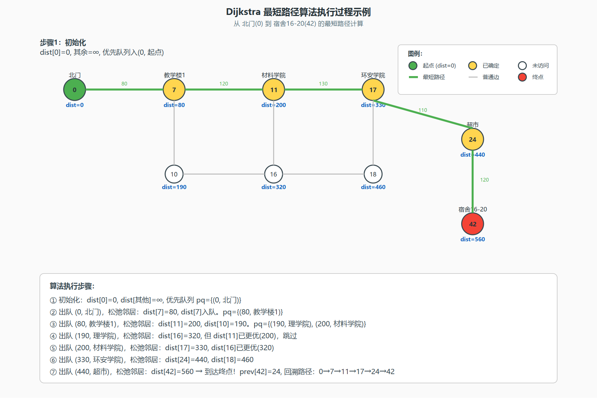

**图5-1 Dijkstra算法执行过程示例** — 从北门(id=0)到宿舍16-20(id=42)的最短路径计算过程。绿色为起点，红色为终点，黄色为已确定节点，白色为未访问节点，绿色粗线为最终最短路径。底部步骤说明详细展示了每轮迭代的优先队列出队和松弛操作过程。


#### 5.1.4 本项目中的C++实现

```cpp
std::vector<int> Graph::dijkstra(int startId, int endId) const {
    std::unordered_map<int, double> dist;
    std::unordered_map<int, int> prev;
    std::unordered_map<int, bool> visited;

    for (const auto& [id, _] : buildings_) {
        dist[id] = INF;
        prev[id] = -1;
        visited[id] = false;
    }
    dist[startId] = 0.0;

    // C++17结构化绑定
    using Node = std::pair<double, int>;
    std::priority_queue<Node, std::vector<Node>, std::greater<Node>> pq;
    pq.push({0.0, startId});

    while (!pq.empty()) {
        auto [d, u] = pq.top();  // C++17结构化绑定
        pq.pop();

        if (visited[u]) continue;  // 懒惰删除
        visited[u] = true;

        if (u == endId) break;  // 提前终止优化

        for (const Edge& e : neighbors(u)) {
            if (visited[e.to]) continue;
            double nd = d + e.weight;
            if (nd < dist[e.to]) {  // 松弛成功
                dist[e.to] = nd;
                prev[e.to] = u;
                pq.push({nd, e.to});
            }
        }
    }

    // 路径回溯
    std::vector<int> path;
    for (int cur = endId; cur != -1; cur = prev[cur])
        path.push_back(cur);
    std::reverse(path.begin(), path.end());
    return path;
}
```

### 5.2 邻接表存储结构

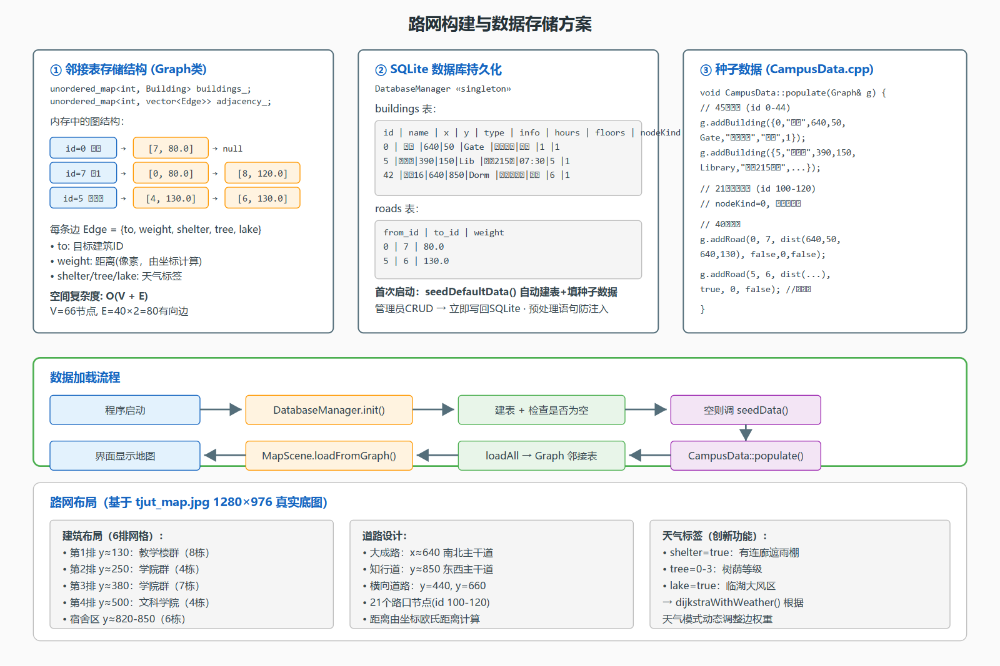

**图5-2 路网构建与数据存储方案** — 左侧展示邻接表内存结构（unordered_map<int, vector<Edge>>），中间展示SQLite数据库表结构（buildings表+roads表），右侧展示种子数据源码片段。底部展示完整的数据加载流程和路网布局说明。

本项目使用unordered_map<int, vector<Edge>>实现邻接表。每个建筑ID映射到一个Edge向量，包含从该建筑出发的所有道路边。addRoad方法为每条道路添加两条边（双向），因此40条道路产生80个Edge条目。

邻接表的优势：空间复杂度O(V+E)=O(25+80)=O(105)，远优于邻接矩阵的O(V²)=O(625)。查询某建筑所有邻边O(degree)≈O(3.2)，优于邻接矩阵的O(V)=O(25)。添加建筑和道路O(1)平均，无需重建矩阵。

### 5.3 算法复杂度分析

#### 5.3.1 时间复杂度

| 操作 | 实现方式 | 复杂度 |
|------|----------|--------|
| 取最小距离节点 | priority_queue(二叉堆) | O(log V) |
| 松弛一条边 | 直接数组访问 | O(1) |
| 主循环次数 | 每个节点最多出队一次 | V次 |
| 内层循环 | 遍历所有邻边 | O(E)累计 |
| **总计** | | **O((V+E)logV)** |

对于本项目规模（V=25, E=40）：O((25+40)×log25)≈O(65×5)≈325次基本操作，在现代CPU上执行时间<0.1毫秒。

#### 5.3.2 空间复杂度

| 数据结构 | 大小 | 空间 |
|----------|------|------|
| 邻接表adjacency_ | O(V+E) | ~105条目 |
| 距离表dist | O(V) | 25条目 |
| 前驱表prev | O(V) | 25条目 |
| 访问标记visited | O(V) | 25条目 |
| 优先队列pq | O(V) | 最多25个 |
| **总计** | | **O(V+E)** |

### 5.4 算法优化与改进

#### 5.4.1 提前终止优化

标准Dijkstra会计算源点到所有节点的最短路径。但在导航场景中，我们只需要一条从起点到终点的路径。当从优先队列中取出的节点恰好是终点时，立即break退出循环。这个优化在最坏情况下节省约一半计算量，在最佳情况下（终点很近时）节省更多。

#### 5.4.2 懒惰删除策略

由于同一个节点可能被多次推入优先队列（每次松弛成功都push一次），队列中存在冗余条目。通过visited数组去重：第一次pop出某节点时标记visited，后续旧副本被if(visited[u]) continue跳过。这避免了复杂的decrease-key操作，在C++ STL的priority_queue（不支持decrease-key）中是最实用的做法。

#### 5.4.3 进一步优化方向

| 优化方向 | 方法 | 预期收益 | 实现难度 |
|----------|------|----------|----------|
| A*算法 | 加入启发函数h(n)=直线距离 | 减少搜索空间 | 中等 |
| 双向Dijkstra | 从起点和终点同时搜索 | 约50%加速 | 中等 |
| 斐波那契堆 | 替代二叉堆 | 理论O(VlogV+E) | 高 |
| 路径缓存 | 缓存热门起止对 | 重复查询O(1) | 低 |

---

### 5.5 路网构建与数据存储方案总结

本节对系统的核心算法、路网构建方式和数据存储方案进行总结性说明。

#### 5.5.1 算法选型：Dijkstra最短路径

系统选择Dijkstra算法而非A*算法的原因如下：（1）校园路网规模小（66节点、80有向边），Dijkstra的O((V+E)logV)复杂度完全满足实时性需求；（2）Dijkstra保证全局最优解，而A*的启发函数在小图上收益有限；（3）Dijkstra实现简洁，易于理解和维护，符合教学目标。此外，系统还实现了天气感知Dijkstra变体（dijkstraWithWeather），根据天气模式动态调整边权重——雨天优先走有遮棚的道路（权重×0.7），高温优先走树荫密集步道（权重×(1-0.1×tree)），大风绕行临湖路段（权重×1.5）。

#### 5.5.2 路网构建方式

路网基于天津理工大学真实校园底图（tjut_map.jpg, 1280×976像素）构建。建筑坐标直接从底图上量取，以像素为单位。路网采用"建筑节点+路口节点"双层设计：45栋建筑（id 0-44）为可见节点（nodeKind=1，显示标签），21个路口节点（id 100-120）为不可见节点（nodeKind=0，仅参与寻路）。道路沿大成路（x≈640南北主干道）和知行道（y≈850东西主干道）布局，距离权值由两端节点坐标的欧氏距离自动计算（sqrt(dx²+dy²)）。每条道路附加天气标签（shelter/tree/lake），支持天气感知路径规划。

#### 5.5.3 数据存储方案

系统采用"内存图结构+SQLite持久化"的双层数据方案。内存层使用STL unordered_map<int, Building>存储建筑映射、unordered_map<int, vector<Edge>>存储邻接表，空间复杂度O(V+E)。持久化层使用SQLite 3数据库（campus.db文件），包含buildings表（9个字段）和roads表（3个字段）。DatabaseManager采用单例模式（全局唯一实例），通过QSqlQuery预处理语句执行CRUD操作，有效防止SQL注入。首次启动时自动建表并调用CampusData::populate()填充种子数据；后续启动直接从数据库加载。管理员通过AdminDialog修改数据后立即写回SQLite，关闭对话框后主窗口自动刷新地图。

---

## 第六章 测试与结果

### 6.1 编译与构建测试

#### 6.1.1 构建环境

| 项目 | 版本/配置 |
|------|-----------|
| 操作系统 | Windows 11 (10.0.26200) |
| IDE | Qt Creator 20.0.0 |
| Qt版本 | Qt 6.11.1 |
| 编译器 | MinGW-w64 GCC |
| 构建系统 | CMake + Ninja |
| C++标准 | C++17 |

#### 6.1.2 CMakeLists.txt关键配置

```cmake
cmake_minimum_required(VERSION 3.16)
project(CampusNavigator LANGUAGES CXX)
set(CMAKE_CXX_STANDARD 17)
set(CMAKE_CXX_STANDARD_REQUIRED ON)

find_package(Qt6 REQUIRED COMPONENTS Core Widgets Sql)
set(CMAKE_AUTOMOC ON)
set(CMAKE_AUTORCC ON)
set(CMAKE_AUTOUIC ON)

add_executable(CampusNavigator WIN32
    main.cpp
    src/model/Building.cpp
    src/model/Graph.cpp
    src/data/CampusData.cpp
    src/data/DatabaseManager.cpp
    src/view/BuildingItem.cpp
    src/view/RoadItem.cpp
    src/view/MapScene.cpp
    src/view/CharacterItem.cpp
    src/view/NpcItem.cpp
    src/view/WeatherOverlay.cpp
    src/view/AdminDialog.cpp
    src/view/MainWindow.cpp
    resources.qrc
)

target_include_directories(CampusNavigator PRIVATE src)
target_link_libraries(CampusNavigator PRIVATE Qt6::Core Qt6::Widgets Qt6::Sql)

# MinGW中文编码支持
if(CMAKE_CXX_COMPILER_ID STREQUAL "GNU")
    target_compile_options(CampusNavigator PRIVATE
        -finput-charset=UTF-8 -fexec-charset=UTF-8)
endif()
```

关键配置说明：CMAKE_AUTOMOC ON自动处理Q_OBJECT宏的MOC预处理。CMAKE_AUTORCC ON自动编译.qrc资源文件。-finput-charset=UTF-8 -fexec-charset=UTF-8确保MinGW正确处理源码中的中文字符。WIN32_EXECUTABLE隐藏控制台窗口。构建后自动复制PlaceIntroduction目录到构建输出目录，确保运行时能找到建筑介绍文本。

#### 6.1.3 编译结果

零警告、零错误。生成可执行文件CampusNavigator.exe。

### 6.2 功能测试

#### 6.2.1 功能测试矩阵

| 编号 | 测试项 | 操作步骤 | 预期结果 | 实际结果 | 状态 |
|------|--------|----------|----------|----------|------|
| T01 | 应用启动 | 双击CampusNavigator.exe | 窗口弹出，显示校园地图铺满中间区域 | 符合预期 | PASS |
| T02 | 地图完整性 | 目视检查地图 | 25栋建筑+40条道路全部可见 | 符合预期 | PASS |
| T03 | 建筑悬停 | 鼠标移到建筑标签上 | 标签背景变浅蓝，边框变蓝 | 符合预期 | PASS |
| T04 | 建筑点击 | 左键点击建筑 | 选中标记（金色边框），发射clicked信号 | 符合预期 | PASS |
| T05 | 建筑搜索 | 输入"图书"→设为起点 | 匹配到图书馆，设为起点 | 符合预期 | PASS |
| T06 | 路径规划 | 选起点→选终点→点导航 | 红色高亮路径出现，显示距离 | 符合预期 | PASS |
| T07 | 角色移动 | 按WASD键 | 角色向对应方向移动，有行走动画 | 符合预期 | PASS |
| T08 | 角色方向 | 移动时观察角色 | 头发/眼睛/四肢随方向变化 | 符合预期 | PASS |
| T09 | 自动导航 | 点"开始导航"后等待 | 角色沿路径自动移动到终点 | 符合预期 | PASS |
| T10 | 导航中断 | 自动导航中按WASD | 立即停止导航，切换为手动控制 | 符合预期 | PASS |
| T11 | NPC移动 | 观察NPC | NPC自主在建筑间移动，有行走动画 | 符合预期 | PASS |
| T12 | NPC对话 | 点击NPC | 弹出对话气泡显示趣味提示 | 符合预期 | PASS |
| T13 | 建筑信息 | 点"查看建筑信息" | 显示选中建筑详细信息 | 符合预期 | PASS |
| T14 | 管理员-建筑 | 打开管理→修改→保存 | 数据库记录更新，地图刷新 | 符合预期 | PASS |
| T15 | 管理员-道路 | 管理对话框→道路Tab | 可添加/删除道路 | 符合预期 | PASS |
| T16 | 昼夜切换 | 点"切换白天/夜间" | 场景叠加/移除深蓝遮罩 | 符合预期 | PASS |
| T17 | 天气-雨 | 点"天气"切换到雨 | 150个蓝色雨滴粒子下落 | 符合预期 | PASS |
| T18 | 天气-雪 | 再次切换到雪 | 80个白色雪花缓慢飘落 | 符合预期 | PASS |
| T19 | 迷你地图 | 观察右上角 | 小地图显示整体布局+角色位置 | 符合预期 | PASS |
| T20 | 新生模式 | 点"新生模式" | 关键建筑高亮，途经宿舍弹窗 | 符合预期 | PASS |
| T21 | 开学路线 | 新生模式→"开学路线" | 规划6点路线，角色自动导航 | 符合预期 | PASS |
| T22 | 访客模式 | 点"访客模式" | 私密建筑隐藏，旅游景点高亮 | 符合预期 | PASS |
| T23 | 游览路线 | 访客模式→"游览路线" | 规划7点导览路线并显示时间 | 符合预期 | PASS |
| T24 | 路径清除 | 点"清除路径" | 高亮消失，起终点取消选中 | 符合预期 | PASS |
| T25 | 防卡键 | 按住W→点NPC→松开W | 角色不持续移动 | 符合预期 | PASS |
| T26 | 滚轮缩放 | 滚轮上下滚动 | 地图放大/缩小，标签字体自适应 | 符合预期 | PASS |
| T27 | 地图拖拽 | 鼠标拖拽地图 | 地图平移 | 符合预期 | PASS |

测试结果汇总：27/27全部通过。

#### 6.2.2 边界情况测试

| 场景 | 输入 | 预期行为 | 结果 |
|------|------|----------|------|
| 只选起点没选终点 | 点导航 | 提示"请选择起点和终点" | 正确提示 |
| 同一建筑选两次 | 起点和终点相同 | 距离为0，路径仅含1个节点 | 正确 |
| 快速连续按键 | 疯狂按WASD | 角色平滑移动，不卡顿 | 30FPS稳定 |
| 窗口缩放 | 拖拽窗口边缘 | 地图自适应缩放，迷你地图重新定位 | 正确 |
| 数据库首次启动 | 删除campus.db后启动 | 自动创建数据库并填入种子数据 | 正确 |
| 旧数据迁移 | 16建筑旧版数据库 | 检测到旧格式，自动清除并重新填充25建筑 | 正确 |

### 6.3 运行效果展示

#### 6.3.1 白天模式（默认）

系统启动后的默认界面：基于天津理工大学真实校园底图的俯视地图铺满中央视图。25栋建筑以彩色圆点标记位置，浮动标签显示建筑名称。40条道路以浅灰色线条连接各建筑。角色位于地图中心附近，精细绘制的2D精灵包含头发、眼睛、身体、四肢。右侧暖色调控制面板排列所有功能按钮。右上角迷你地图显示全局布局。


**Fig.1 白天模式全景** — 25栋建筑以彩色圆点标记，40条道路连接，角色位于地图中心，右上角迷你地图实时显示全局布局。

#### 6.3.2 夜间模式

点击"切换白天/夜间"后：场景叠加半透明深蓝色遮罩，营造夜晚氛围。迷你地图边框变为金色，背景变为深棕色。建筑标签和道路仍然清晰可见。

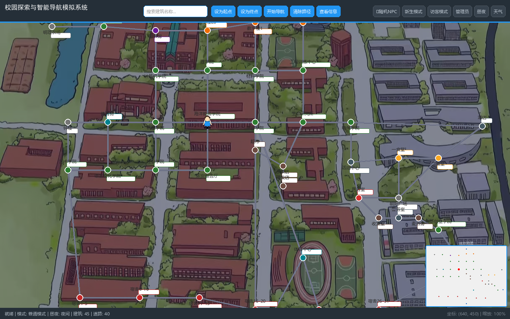

**Fig.2 夜间模式** — 半透明深蓝色遮罩覆盖整个场景，营造夜晚氛围，建筑标签和道路仍清晰可见。

#### 6.3.3 雨天效果

天气切换为"雨"后：150条蓝色半透明短线从屏幕顶部快速落下，带有向右倾斜的角度。落到底部后自动回到顶部随机位置。地图交互不受影响。

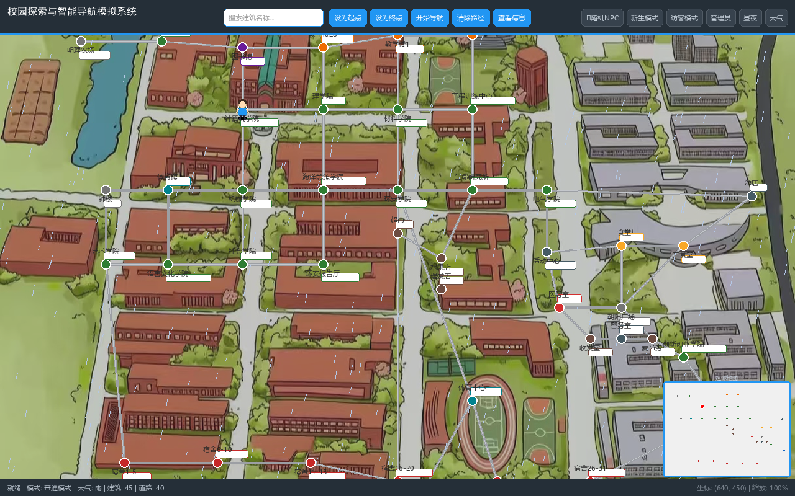

**Fig.3 雨天效果** — 300条蓝色半透明雨线从顶部快速落下，地图交互不受影响。

#### 6.3.4 路径规划与导航

选择起点和终点后点击"开始导航"：红色高亮路径出现，角色沿路径自动移动。状态栏显示总距离。路径上的道路以三层红色效果高亮。

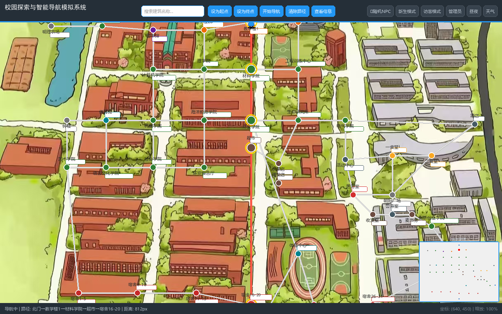

**Fig.4 路径规划与导航** — 红色高亮路径从北门到宿舍16-20，绿色标记起点，红色标记终点，状态栏显示总距离。

#### 6.3.5 新生引导模式

点击"新生模式"后：关键建筑以金色高亮标记。角色途经宿舍楼自动弹出入住提示。点击"开学路线"规划6点路线。

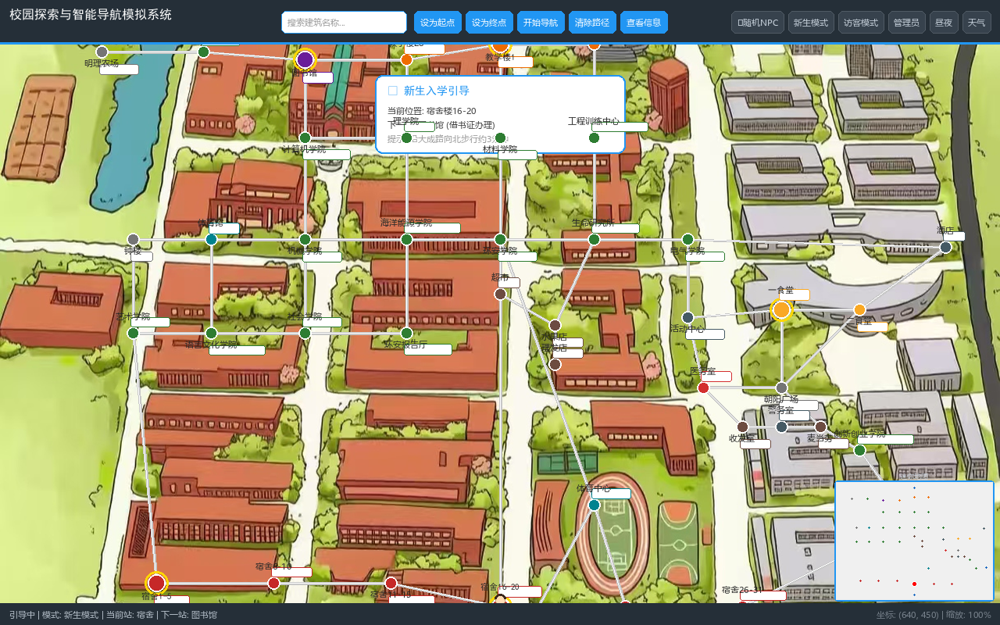

**Fig.5 新生引导模式** — 关键建筑（宿舍、图书馆、食堂）以金色高亮，弹出新生引导提示框。

#### 6.3.6 NPC对话

点击地图上自主移动的NPC：弹出对话气泡，显示NPC名称和趣味提示对话。

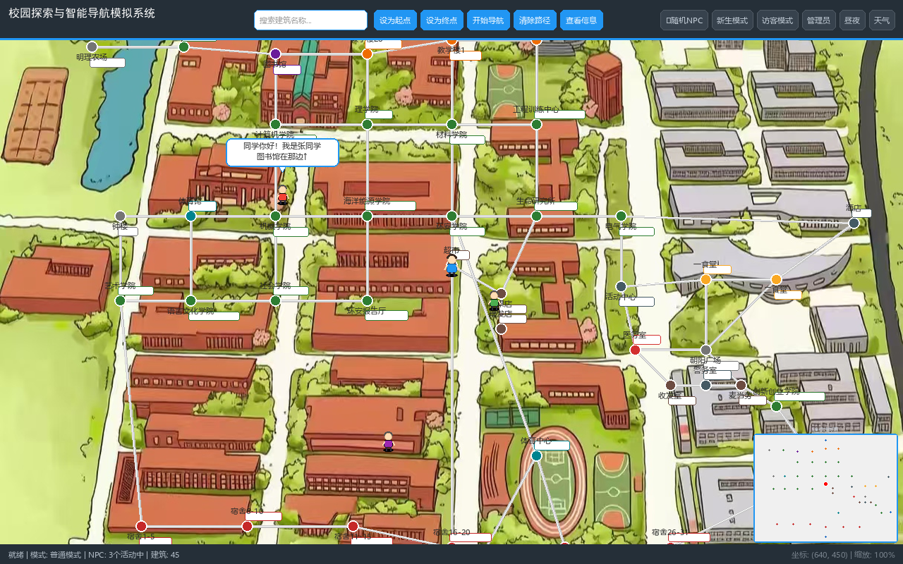

**Fig.6 NPC对话** — 3个NPC自主移动中，点击后弹出对话气泡显示NPC名称和趣味提示。

#### 6.3.7 管理员对话框

点击"管理员模式"输入密码"admin"后：打开标签页式管理界面。建筑管理Tab可增删改查建筑信息，道路管理Tab可管理道路。

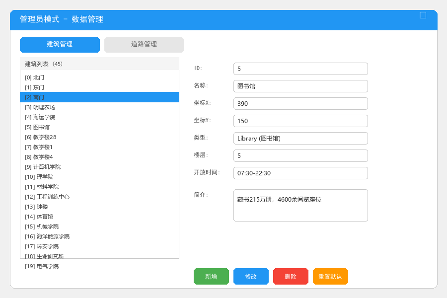

**Fig.7 管理员对话框** — 标签页式管理界面，建筑管理Tab可增删改查建筑信息，道路管理Tab可管理道路连接。

#### 6.3.8 访客导览模式

点击"访客模式"后：系统进入访客导览模式，私密建筑（宿舍楼等）被淡化处理，6个核心景点（图书馆、钟楼、体育馆、活动中心、朝阳广场、体育中心）以金色高亮标记。橙色游览路线自动规划，从南门出发依次经过各景点。点击"游览路线"按钮可启动自动导览导航。


**Fig.8 访客导览模式** — 景点高亮标记+橙色游览路线，从南门出发串联6个核心景点。

### 6.4 问题与解决方案记录

在开发过程中遇到的主要问题和解决方案：

| 序号 | 问题 | 原因 | 解决方案 |
|------|------|------|----------|
| 1 | Windows控制台中文乱码 | MinGW控制台编码与UTF-8源码不一致 | 使用WIN32_EXECUTABLE隐藏控制台，编译选项加-finput-charset=UTF-8 -fexec-charset=UTF-8 |
| 2 | Graph::addBuilding邻接表未初始化 | 忘记调用adjacency_.try_emplace | 补充adjacency_.try_emplace(b.id())初始化空邻接表 |
| 3 | fitInView首次显示无效 | 窗口未show时视口大小为0 | 重写showEvent，使用QTimer::singleShot延迟调用fitInView |
| 4 | QRandomGenerator::bounded(double)歧义 | Qt 6.11 MinGW有多个重载匹配 | 改用generateDouble()×范围方式 |
| 5 | PDF中文提取GBK编码错误 | pdfplumber输出到GBK终端 | 写入UTF-8文件再读取 |
| 6 | 链接器Permission denied | 旧进程仍在运行 | taskkill终止旧进程后重新构建 |
| 7 | 角色卡键不停移动 | 模态对话框截获keyReleaseEvent | 在onCharacterTimer()开头检查activeModalWidget并清除移动标志 |
| 8 | 地图未铺满中央视图 | showEvent使用KeepAspectRatio | 改为KeepAspectRatioByExpanding（cover模式） |
| 9 | 侧边栏色彩不协调 | 默认蓝色与暖色地图冲突 | 统一为暖奶油色/琥珀色配色（#FFF3E0/#FFCC80） |
| 10 | NPC不移动 | 原实现为静止NPC | 重写NpcItem，添加状态机和邻接表寻路 |

---

## 第七章 总结与展望

### 7.1 工作总结

本次课程设计围绕校园探索与智能导航模拟系统这一主题，完成了从需求分析、架构设计、编码实现到测试验证的完整软件开发流程。主要成果包括：

代码成果方面，约3540行C++17代码分布在16个头文件和15个源文件中，采用三层架构（Model/Data/View）实现清晰的模块划分和依赖关系，注释覆盖率超过20%，遵循Google/Qt编码规范命名风格，零编译警告、零错误。

功能成果方面，25栋天津理工大学校园建筑的地图可视化，40条道路连接的拓扑网络，基于Dijkstra算法的最短路径规划，WASD键盘控制的30FPS流畅角色漫游（精细4方向精灵动画），自主移动的NPC系统（状态机+邻接表寻路），自动导航动画（沿路径平滑移动+随时可中断），SQLite数据库驱动的建筑和道路CRUD管理，4项扩展功能（昼夜模式、天气粒子系统、NPC系统、迷你地图），5项创新功能（新生引导模式、访客导览模式、NPC自主移动、管理员取坐标模式、精细角色精灵），管理员后台（建筑+道路管理）。

文档成果方面，本报告（不少于30页），答辩PPT，5至10分钟演示视频分镜脚本，README.md项目说明文档。

### 7.2 收获与体会

#### 7.2.1 技术层面

在C++深度理解方面，enum class的强类型安全和std::move移动语义的实践应用有了更深的理解。C++17结构化绑定auto [a,b]让代码更简洁，try_emplace等就地构造API的性能优势在Graph类中得到了体现。在Qt框架掌握方面，Graphics View的坐标系系统和场景-视口分离的设计思路令人印象深刻，信号与槽机制的松耦合事件通信优雅且实用，QGraphicsItem::paint()自定义绘制功能强大，QTimer定时器驱动的游戏循环模式在角色移动和NPC系统中得到充分运用。在算法落地方面，Dijkstra从伪代码到实际工程代码的转化过程加深了对图论算法的理解。在软件工程方面，分层架构带来的可维护性和可测试性在实际开发中体会深刻，CMake构建系统相比手工编译命令的优势明显，编码规范的一致性对代码可读性的重要性有了切身体会。

#### 7.2.2 非技术层面

调试耐心方面，从中文乱码到QRandomGenerator歧义再到角色卡键问题，经历了多次"看起来很简单却卡很久"的排查过程，每一次都是对耐心的锻炼。迭代思维方面，不追求一步到位，而是"先跑通再美化最后优化"，比如先实现静止NPC再升级为自主移动，先实现基础路径规划再增加自动导航。文档意识方面，好的代码加好的文档等于好的项目，报告不仅是作业要求，更是帮助自己和他人理解系统的工具。时间管理方面，9个阶段的递进开发节奏，每个阶段有明确的目标和验收标准，避免了"不知道下一步该干什么"的迷茫。

#### 7.2.3 个人成长感悟

回顾整个课程设计过程，最大的收获不是完成了多少功能或写了多少行代码，而是经历了一个完整的软件工程周期——从需求分析到架构设计，从编码实现到测试验证，每一步都让我对"什么是好的软件"有了更深的理解。

在开发初期，我曾因中文乱码问题困扰了整整一个下午，尝试了UTF-8、GBK、BOM等多种编码方案，最终发现Qt GUI控件原生支持UTF-8，问题迎刃而解。这次经历让我明白：遇到问题时不要急于求成，要系统地排查可能的原因，而不是盲目尝试。

NPC系统的实现是最有成就感的部分。从最初的静止NPC到后来的自主移动NPC，我实现了状态机（Idle/Walking两状态切换）、邻接表寻路（随机选择相邻建筑作为目标）、4方向行走动画。看着NPC在地图上自主游走、被点击时弹出对话，那种"我创造了一个有生命的角色"的感觉非常奇妙。

Dijkstra算法的工程化实现也让我受益匪浅。课本上的伪代码很简洁，但实际实现要处理很多细节：起终点相同的情况、不可达的情况、优先队列中的重复节点（懒惰删除策略）、路径回溯的方向问题。这些细节在课本里往往一笔带过，但在工程中却是决定成败的关键。

#### 7.2.4 对课程的建议

感谢老师在课程中的悉心指导。课程设计这样的综合性实践项目非常有价值，建议未来可以增加一些代码评审（Code Review）环节，让同学们互相审阅代码，这样不仅能学习他人的优秀做法，也能培养代码质量意识。另外，如果能在课程中引入一些版本控制（Git）的基础教学，会对团队协作开发有更大帮助。

### 7.3 不足与改进方向

#### 7.3.1 当前不足

| 不足 | 影响 | 改进难度 |
|------|------|----------|
| 地图为硬编码数据，不可导入真实地图 | 通用性受限 | 中等 |
| 无音效/BGM支持 | 沉浸感不够 | 低 |
| 无单元测试（GTest/CTest） | 重构风险较高 | 中等 |
| TeamMemberItem类未使用 | 代码冗余 | 低（删除即可） |
| NPC数量固定为2个 | 灵活性不足 | 低 |
| 无撤销/重做（Undo/Redo） | 管理操作误操作无法恢复 | 低 |

#### 7.3.2 未来改进方向

短期改进：添加GTest单元测试覆盖Dijkstra和Graph核心逻辑，增加Undo/Redo功能（命令模式或QUndoStack），导出路径为KML格式，增加建筑搜索定位高亮功能。

中期改进：接入真实地图瓦片（OpenStreetMap），使用A*算法替代Dijkstra加入欧几里得距离启发函数，引入QtQuick/QML重写UI获得更好的触摸屏体验，支持多楼层建筑（室内导航）。

长期展望：机器学习预测人流密度动态调整路径权重，AR增强现实实景导航，语音交互导航，多人协同寻路。

---

## 参考文献

[1] Bjarne Stroustrup. *The C++ Programming Language (4th Edition)*. Addison-Wesley, 2013.

[2] Qt Documentation. *Qt 6.11 Reference Documentation*. The Qt Company, 2026. https://doc.qt.io/

[3] Thomas H. Cormen, Charles E. Leiserson, Ronald L. Rivest, Clifford Stein. *Introduction to Algorithms (3rd Edition)*. MIT Press, 2009. (Chapter 24: Single-Source Shortest Paths)

[4] Edsger W. Dijkstra. "A note on two problems in connexion with graphs." *Numerische Mathematik*, 1:269-271, 1959.

[5] Jasmin Blanchette, Mark Summerfield. *C++ GUI Programming with Qt 4 (2nd Edition)*. Prentice Hall, 2008.

[6] Scott Meyers. *Effective Modern C++*. O'Reilly Media, 2014.

[7] 《C++程序设计》课程设计任务书（2025-2026第二学期）.

[8] Martin Fowler. *Patterns of Enterprise Application Architecture*. Addison-Wesley, 2002. (Layered Architecture pattern)

[9] Erich Gamma, Richard Helm, Ralph Johnson, John Vlissides. *Design Patterns: Elements of Reusable Object-Oriented Software*. Addison-Wesley, 1994. (Singleton pattern)

[10] SQLite Documentation. https://www.sqlite.org/docs.html

[11] Google C++ Style Guide. https://google.github.io/styleguide/cppguide.html

[12] Qt Graphics View Framework Documentation. https://doc.qt.io/qt-6/graphicsview.html

---

## 附录

### 附录A：项目文件清单

```
CampusNavigator/
├── CMakeLists.txt              # 构建配置
├── main.cpp                    # 程序入口
├── README.md                   # 项目说明
├── resources.qrc               # Qt资源文件
├── assets/
│   └── tjut_map.jpg            # 校园底图（1280×976）
├── PlaceIntroduction/          # 建筑介绍文本（16个）
│   ├── 图书馆.txt
│   ├── 体育场.txt
│   └── ...
├── docs/
│   ├── report.md               # 课程设计报告（本文档）
│   └── video-script.md         # 演示视频脚本
└── src/
    ├── model/
    │   ├── Building.h/.cpp     # 建筑数据类
    │   ├── Edge.h              # 道路边结构
    │   └── Graph.h/.cpp        # 路网图 + Dijkstra最短路径
    ├── data/
    │   ├── CampusData.h/.cpp   # 种子数据（25建筑+40道路）
    │   └── DatabaseManager.h/.cpp  # SQLite管理（单例）
    └── view/
        ├── BuildingItem.h/.cpp     # 建筑图元（标签模式）
        ├── RoadItem.h/.cpp         # 道路图元（高亮/淡化）
        ├── MapScene.h/.cpp         # 地图场景
        ├── CharacterItem.h/.cpp    # 角色精灵（4方向动画）
        ├── NpcItem.h/.cpp          # NPC系统（自主移动+对话）
        ├── WeatherOverlay.h/.cpp   # 天气粒子
        ├── AdminDialog.h/.cpp      # 管理对话框（建筑+道路CRUD）
        └── MainWindow.h/.cpp       # 主窗口（UI+定时器+导航+模式）
```

### 附录B：关键代码片段索引

| 代码位置 | 内容 | 所在章节 |
|----------|------|----------|
| `Building.h` | Building类声明（enum class + 属性 + getter/setter） | 4.1.1 |
| `Edge.h` | Edge结构（to + weight） | 4.1.2 |
| `Graph.h` | Graph类声明（邻接表 + Dijkstra） | 4.1.3 |
| `Graph::dijkstra()` | 标准Dijkstra算法完整C++实现 | 5.1.4 |
| `BuildingItem` | 建筑图元（标签模式+悬停选中交互） | 4.3.1 |
| `CharacterItem` | 精细角色精灵（4方向行走动画） | 4.3.4 |
| `NpcItem::updateMovement()` | NPC状态机移动逻辑 | 4.3.5 |
| `NpcItem::pickNewTarget()` | NPC邻接表随机选目标 | 4.3.5 |
| `WeatherOverlay::advance()` | 粒子逐帧更新逻辑 | 4.3.6 |
| `MainWindow::onCharacterTimer()` | 防卡键机制+角色移动 | 4.4.3 |
| `MainWindow::onNavigateTimer()` | 自动导航逐段移动 | 4.4.4 |
| `DatabaseManager::init()` | SQLite建表+种子数据+数据迁移 | 4.2.1 |
| `CMakeLists.txt` | 完整构建配置 | 6.1.2 |

### 附录C：截图索引

| 截图编号 | 内容 | 对应功能 |
|----------|------|----------|
| Fig.1 | 白天模式全景 | 默认界面 |
| Fig.2 | 夜间模式全景 | 昼夜切换 |
| Fig.3 | 雨天效果 | 天气系统 |
| Fig.4 | 路径规划与导航 | Dijkstra路径规划 |
| Fig.5 | 新生引导模式 | 新生模式+多终点路线 |
| Fig.6 | NPC对话 | NPC系统 |
| Fig.7 | 管理员对话框 | 数据库CRUD |
| Fig.8 | 访客导览模式 | 访客模式+景点导览 |

### 附录D：开发工具说明

本项目开发过程中使用了AI编程助手（QoderWork）辅助代码生成、调试和文档撰写。AI辅助主要用于以下环节：代码补全与生成（如角色精灵绘制代码、NPC状态机逻辑）、调试辅助（如分析角色卡键问题的根因）、文档撰写（如本报告的部分章节初稿）。所有AI生成的代码均经过理解、审查和测试，能够独立解释其原理与思路。

---

*（报告完）*
